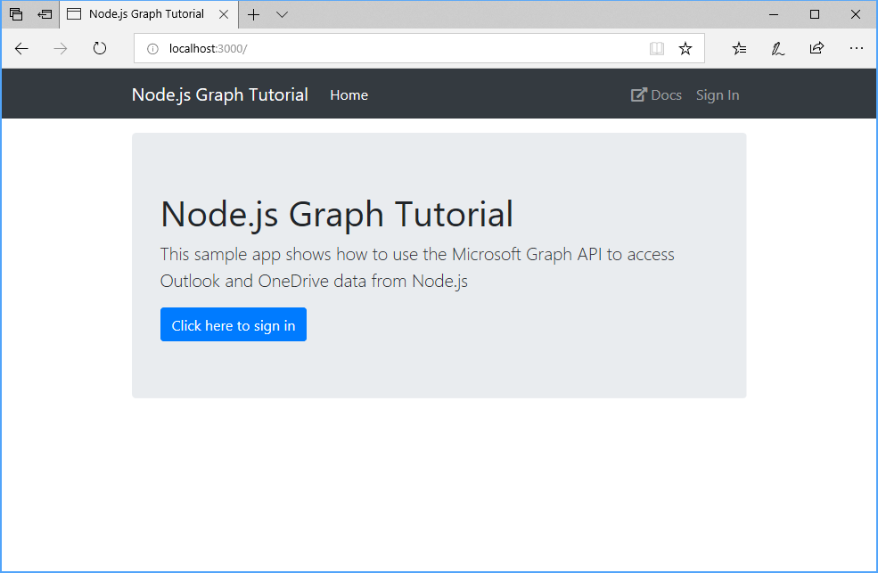

<!-- markdownlint-disable MD002 MD041 -->

在本练习中，将使用[Express](http://expressjs.com/)生成 web 应用程序。

1. 打开您的 CLI，导航到您有权创建文件的目录，然后运行以下命令，以创建一个使用[Handlebars](http://handlebarsjs.com/)作为呈现引擎的新 Express 应用程序。

    ```Shell
    npx express-generator@4.16.1 --hbs graph-tutorial
    ```

    Express 生成器将创建一个名`graph-tutorial`为 "搭建基架" 的新目录，并将其作为 Express 应用程序。

1. 导航到该`graph-tutorial`目录，然后输入以下命令以安装依赖项。

    ```Shell
    npm install
    ```

1. 运行以下命令以使用报告的漏洞更新节点程序包。

    ```Shell
    npm audit fix
    ```

1. 使用以下命令启动本地 web 服务器。

    ```Shell
    npm start
    ```

1. 打开浏览器，并导航到 `http://localhost:3000`。 如果一切正常，你将看到 "欢迎使用快递" 消息。 如果看不到该消息，请查看[Express 入门指南](http://expressjs.com/starter/generator.html)。

## <a name="install-node-packages"></a>安装节点包

在继续操作之前，请先安装将使用的其他一些程序包：

- 用于从 env 文件加载值的[dotenv](https://github.com/motdotla/dotenv) 。
- 设置日期/时间值格式的[时刻](https://github.com/moment/moment/)。
- 在应用程序中[连接-闪烁](https://github.com/jaredhanson/connect-flash)到闪存错误消息。
- 将值存储在内存中的服务器端会话中的[快速会话](https://github.com/expressjs/session)。
- [passport-azure-ad](https://github.com/AzureAD/passport-azure-ad)身份验证和获取访问令牌。
- [简单-oauth2](https://github.com/lelylan/simple-oauth2)用于令牌管理。
- microsoft graph-用于调用 Microsoft Graph 的[客户端](https://github.com/microsoftgraph/msgraph-sdk-javascript)。
- [isomorphic-](https://github.com/matthew-andrews/isomorphic-fetch) polyfill 获取对节点的提取。 `microsoft-graph-client`库需要获取 polyfill。 有关详细信息，请参阅[Microsoft Graph JavaScript 客户端库 wiki](https://github.com/microsoftgraph/msgraph-sdk-javascript/wiki/Migration-from-1.x.x-to-2.x.x#polyfill-only-when-required) 。

1. 在 CLI 中运行以下命令。

    ```Shell
    npm install dotenv@8.2.0 moment@2.24.0 connect-flash@0.1.1 express-session@1.17.0 isomorphic-fetch@2.2.1
    npm install passport-azure-ad@4.2.1 simple-oauth2@3.3.0 @microsoft/microsoft-graph-client@2.0.0
    ```

    > [!TIP]
    > Windows 用户在尝试在 Windows 上安装这些程序包时可能会收到以下错误消息。
    >
    > ```Shell
    > gyp ERR! stack Error: Can't find Python executable "python", you can set the PYTHON env variable.
    > ```
    >
    > 若要解决此错误，请运行以下命令，以使用安装 VS 生成工具和 Python 的提升（管理员）终端窗口来安装 Windows 生成工具。
    >
    > ```Shell
    > npm install --global --production windows-build-tools
    > ```

1. 更新应用程序以使用`connect-flash`和`express-session`中间件。 打开`./app.js`文件，并将以下`require`语句添加到文件顶部。

    ```javascript
    var session = require('express-session');
    var flash = require('connect-flash');
    ```

1. 紧接着行的`var app = express();`后面添加以下代码。

    :::code language="javascript" source="../demo/graph-tutorial/app.js" id="SessionSnippet":::

## <a name="design-the-app"></a>设计应用程序

在本节中，您将实现应用程序的 UI。

1. 打开`./views/layout.hbs`文件，并将整个内容替换为以下代码。

    :::code language="html" source="../demo/graph-tutorial/views/layout.hbs" id="LayoutSnippet":::

    此代码添加简单样式的[引导](http://getbootstrap.com/)，并添加一些简单图标的[字体](https://fontawesome.com/)。 它还定义具有导航栏的全局布局。

1. 打开`./public/stylesheets/style.css`并将其全部内容替换为以下内容。

    :::code language="css" source="../demo/graph-tutorial/public/stylesheets/style.css":::

1. 打开`./views/index.hbs`文件，并将其内容替换为以下内容。

    :::code language="html" source="../demo/graph-tutorial/views/index.hbs" id="IndexSnippet":::

1. 打开`./routes/index.js`文件，并将现有代码替换为以下代码。

    :::code language="javascript" source="../demo/graph-tutorial/routes/index.js" id="IndexRouterSnippet" highlight="6-10":::

1. 保存所有更改，然后重新启动服务器。 现在，应用程序看起来应非常不同。

    
