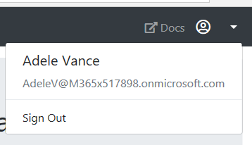

<!-- markdownlint-disable MD002 MD041 -->

在本练习中，你将扩展上一练习中的应用程序，以支持 Azure AD 的身份验证。 若要获取所需的 OAuth 访问令牌以调用 Microsoft Graph，这是必需的。 在此步骤中，将[passport azure ad](https://github.com/AzureAD/passport-azure-ad)库集成到应用程序中。

1. 在应用程序的根目录`.env`中，创建一个名为 file 的新文件，并添加以下代码。

    :::code language="ini" source="../demo/graph-tutorial/.env.example":::

    将`YOUR APP ID HERE`替换为应用程序注册门户中的应用程序 ID， `YOUR APP SECRET HERE`并将替换为您生成的密码。

    > [!IMPORTANT]
    > 如果您使用的是源代码管理（如 git），现在可以从源代码管理中排除`.env`该文件，以避免无意中泄漏您的应用程序 ID 和密码。

1. 打开`./app.js`并将以下行添加到文件顶部，以加载`.env`文件。

    ```javascript
    require('dotenv').config();
    ```

## <a name="implement-sign-in"></a>实施登录

1. 找到中`./app.js`的`var indexRouter = require('./routes/index');`行。 **在该行前**插入以下代码。

    ```javascript
    var passport = require('passport');
    var OIDCStrategy = require('passport-azure-ad').OIDCStrategy;

    // Configure passport

    // In-memory storage of logged-in users
    // For demo purposes only, production apps should store
    // this in a reliable storage
    var users = {};

    // Passport calls serializeUser and deserializeUser to
    // manage users
    passport.serializeUser(function(user, done) {
      // Use the OID property of the user as a key
      users[user.profile.oid] = user;
      done (null, user.profile.oid);
    });

    passport.deserializeUser(function(id, done) {
      done(null, users[id]);
    });

    // Callback function called once the sign-in is complete
    // and an access token has been obtained
    async function signInComplete(iss, sub, profile, accessToken, refreshToken, params, done) {
      if (!profile.oid) {
        return done(new Error("No OID found in user profile."));
      }

      // Save the profile and tokens in user storage
      users[profile.oid] = { profile, accessToken };
      return done(null, users[profile.oid]);
    }

    // Configure OIDC strategy
    passport.use(new OIDCStrategy(
      {
        identityMetadata: `${process.env.OAUTH_AUTHORITY}${process.env.OAUTH_ID_METADATA}`,
        clientID: process.env.OAUTH_APP_ID,
        responseType: 'code id_token',
        responseMode: 'form_post',
        redirectUrl: process.env.OAUTH_REDIRECT_URI,
        allowHttpForRedirectUrl: true,
        clientSecret: process.env.OAUTH_APP_PASSWORD,
        validateIssuer: false,
        passReqToCallback: false,
        scope: process.env.OAUTH_SCOPES.split(' ')
      },
      signInComplete
    ));
    ```

    此代码会将[Passport .js](http://www.passportjs.org/)库初始化为使用`passport-azure-ad`库，并使用应用程序的应用 ID 和密码对其进行配置。

1. 找到中`./app.js`的`app.use('/', indexRouter);`行。 **在该行前**插入以下代码。

    ```javascript
    // Initialize passport
    app.use(passport.initialize());
    app.use(passport.session());
    ```

1. 在名为`./routes` `auth.js`的目录中创建一个新文件，并添加以下代码。

    ```javascript
    var express = require('express');
    var passport = require('passport');
    var router = express.Router();

    /* GET auth callback. */
    router.get('/signin',
      function  (req, res, next) {
        passport.authenticate('azuread-openidconnect',
          {
            response: res,
            prompt: 'login',
            failureRedirect: '/',
            failureFlash: true,
            successRedirect: '/'
          }
        )(req,res,next);
      }
    );

    router.post('/callback',
      function(req, res, next) {
        passport.authenticate('azuread-openidconnect',
          {
            response: res,
            failureRedirect: '/',
            failureFlash: true
          }
        )(req,res,next);
      },
      function(req, res) {
        // TEMPORARY!
        // Flash the access token for testing purposes
        req.flash('error_msg', {message: 'Access token', debug: req.user.accessToken});
        res.redirect('/');
      }
    );

    router.get('/signout',
      function(req, res) {
        req.session.destroy(function(err) {
          req.logout();
          res.redirect('/');
        });
      }
    );

    module.exports = router;
    ```

    这将定义具有三个路由的`signin`路由器`callback`：、 `signout`和。

    `signin`路由将调用`passport.authenticate`方法，从而导致应用重定向到 Azure 登录页面。

    `callback`路由是在登录完成后 Azure 重定向的位置。 代码再次调用该`passport.authenticate`方法，从而导致`passport-azure-ad`策略请求访问令牌。 获取令牌后，将调用下一个处理程序，该处理程序将重定向回包含临时错误值中的访问令牌的主页。 在继续操作之前，我们将使用此操作来验证登录是否正常工作。 在测试之前，我们需要将 Express 应用配置为使用新的路由器`./routes/auth.js`。

    该`signout`方法将注销用户并销毁会话。

1. 打开`./app.js`并插入以下代码， **before**并将`var app = express();`其插入到行前面。

    ```javascript
    var authRouter = require('./routes/auth');
    ```

1. 在`app.use('/', indexRouter);`行**后**插入以下代码。

    ```javascript
    app.use('/auth', authRouter);
    ```

启动服务器并浏览到`https://localhost:3000`。 单击 "登录" 按钮，您应会被重定向`https://login.microsoftonline.com`到。 使用你的 Microsoft 帐户登录，并同意请求的权限。 浏览器重定向到应用程序，并显示令牌。

### <a name="get-user-details"></a>获取用户详细信息

1. 在名为`graph.js`的项目的根目录中创建一个新文件，并添加以下代码。

    ```javascript
    var graph = require('@microsoft/microsoft-graph-client');
    require('isomorphic-fetch');

    module.exports = {
      getUserDetails: async function(accessToken) {
        const client = getAuthenticatedClient(accessToken);

        const user = await client.api('/me').get();
        return user;
      }
    };

    function getAuthenticatedClient(accessToken) {
      // Initialize Graph client
      const client = graph.Client.init({
        // Use the provided access token to authenticate
        // requests
        authProvider: (done) => {
          done(null, accessToken);
        }
      });

      return client;
    }
    ```

    这将`getUserDetails`导出函数，该函数使用 MICROSOFT Graph SDK 调用`/me`终结点并返回结果。

1. 打开`/app.js`并将以下`require`语句添加到文件顶部。

    ```javascript
    var graph = require('./graph');
    ```

1. 将现有的 `signInComplete` 函数替换成以下代码。

    ```javascript
    async function signInComplete(iss, sub, profile, accessToken, refreshToken, params, done) {
      if (!profile.oid) {
        return done(new Error("No OID found in user profile."));
      }

      try{
        const user = await graph.getUserDetails(accessToken);

        if (user) {
          // Add properties to profile
          profile['email'] = user.mail ? user.mail : user.userPrincipalName;
        }
      } catch (err) {
        return done(err);
      }

      // Save the profile and tokens in user storage
      users[profile.oid] = { profile, accessToken };
      return done(null, users[profile.oid]);
    }
    ```

    新代码会使用 Microsoft `profile` Graph 返回的数据更新由`email` Passport 提供的属性，以添加属性。

1. **在** `app.use(passport.session());`行后面添加以下项。

    :::code language="javascript" source="../demo/graph-tutorial/app.js" id="AddProfileSnippet":::

    此代码将用户配置文件加载到`locals`响应的属性中。 这将使其可用于应用程序中的所有视图。

## <a name="storing-the-tokens"></a>存储令牌

现在，您可以获取令牌，现在是时候实现将它们存储在应用程序中的方法了。 目前，应用程序将原始访问令牌存储在内存中的用户存储中。 由于这是一个示例应用程序，因此为简单起见，你将继续将其存储在此处。 实际应用程序将使用更可靠的安全存储解决方案，就像数据库一样。

但是，仅存储访问令牌不允许您检查过期或刷新令牌。 若要启用此目的，请更新示例以包装`AccessToken`对象中的对象和`simple-oauth2`库中的标记。

1. 打开`./app.js`并在`signInComplete`函数**前面**添加以下代码。

    :::code language="javascript" source="../demo/graph-tutorial/app.js" id="ConfigureOAuth2Snippet":::

1. 将现有的 `signInComplete` 函数替换为以下内容。

    :::code language="javascript" source="../demo/graph-tutorial/app.js" id="SignInCompleteSnippet" highlight="17-18, 21":::

1. 将中的现有回调路由`./routes/auth.js`替换为以下项。

    :::code language="javascript" source="../demo/graph-tutorial/routes/auth.js" id="CallbackRouteSnippet" highlight="17-18":::

1. 重新启动服务器并完成登录过程。 您应该最后返回到主页，但 UI 应更改以指示您已登录。

    

1. 单击右上角的用户头像以访问 "**注销**" 链接。 单击 "**注销**" 重置会话并返回到主页。

    

## <a name="refreshing-tokens"></a>刷新令牌

此时，您的应用程序具有访问令牌，该令牌是在 API `Authorization`调用的标头中发送的。 这是允许应用代表用户访问 Microsoft Graph 的令牌。

但是，此令牌的生存期较短。 令牌在发出后会过期一小时。 这就是刷新令牌变得有用的地方。 刷新令牌允许应用在不要求用户重新登录的情况下请求新的访问令牌。

1. 在名`tokens.js`为的项目的根目录中创建一个新文件，以保留令牌管理函数。 添加以下代码。

    :::code language="javascript" source="../demo/graph-tutorial/tokens.js" id="TokensSnippet":::

此方法首先检查访问令牌是否已过期或接近即将过期。 如果是，则它使用刷新令牌获取新令牌，然后更新缓存并返回新的访问令牌。 只要您需要从存储区中获取访问令牌，就可以使用此方法。
