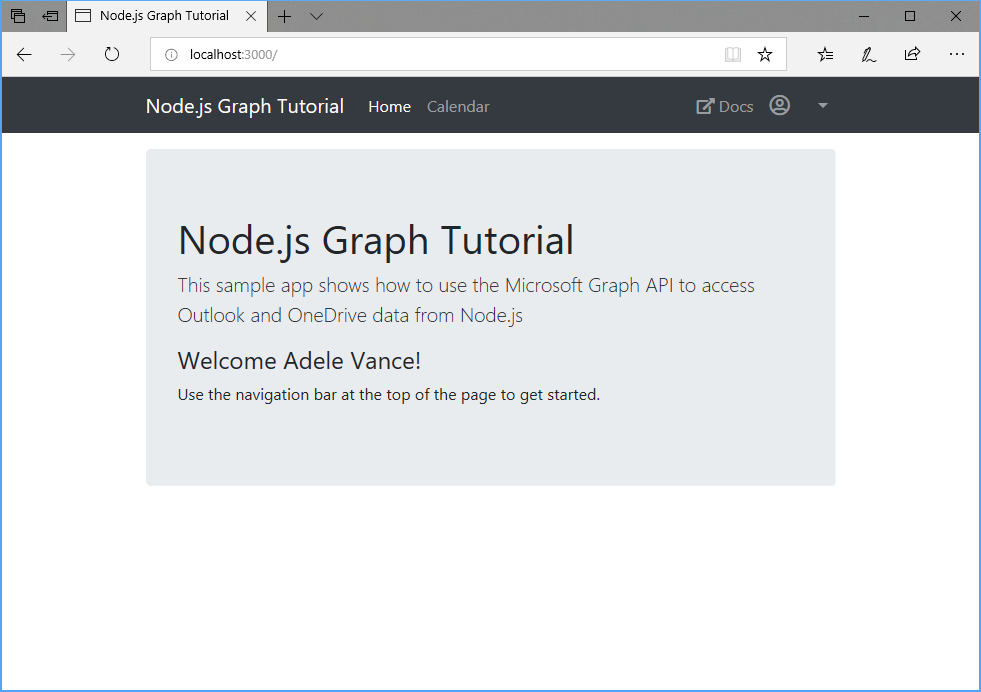

<!-- markdownlint-disable MD002 MD041 -->

在本练习中，你将扩展上一练习中的应用程序，以支持 Azure AD 的身份验证。 若要获取所需的 OAuth 访问令牌以调用 Microsoft Graph，这是必需的。 在此步骤中，将 [msal 节点](https://github.com/AzureAD/microsoft-authentication-library-for-js/tree/dev/lib/msal-node) 库集成到应用程序中。

1. 在应用程序的根目录中，创建一个名为 **. env** 的新文件，并添加以下代码。

    :::code language="ini" source="../demo/graph-tutorial/example.env":::

    将替换 `YOUR_CLIENT_SECRET_HERE` 为应用程序注册门户中的应用程序 ID，并将替换 `YOUR_APP_SECRET_HERE` 为您生成的客户端密码。

    > [!IMPORTANT]
    > 如果您使用的是源代码管理（如 git），现在是从源代码控制中排除 **env** 文件以避免无意中泄漏您的应用程序 ID 和密码的一段时间。

1. 打开 **。/app.js** 并将以下行添加到文件顶部，以加载该 **env** 文件。

    ```javascript
    require('dotenv').config();
    ```

## <a name="implement-sign-in"></a>实施登录

1. 找到中的 "" 行 `var indexRouter = require('./routes/index');` **。/app.js** 。 **在该行前** 插入以下代码。

    :::code language="javascript" source="../demo/graph-tutorial/app.js" id="MsalInitSnippet":::

    此代码使用应用程序的应用 ID 和密码初始化 msal 的节点库。

1. 在名为 **auth.js** 的 **/routes** 目录中创建一个新文件，并添加以下代码。

    ```javascript
    var router = require('express-promise-router')();

    /* GET auth callback. */
    router.get('/signin',
      async function (req, res) {
        const urlParameters = {
          scopes: process.env.OAUTH_SCOPES.split(','),
          redirectUri: process.env.OAUTH_REDIRECT_URI
        };

        try {
          const authUrl = await req.app.locals
            .msalClient.getAuthCodeUrl(urlParameters);
          res.redirect(authUrl);
        }
        catch (error) {
          console.log(`Error: ${error}`);
          req.flash('error_msg', {
            message: 'Error getting auth URL',
            debug: JSON.stringify(error, Object.getOwnPropertyNames(error))
          });
          res.redirect('/');
        }
      }
    );

    router.get('/callback',
      async function(req, res) {
        const tokenRequest = {
          code: req.query.code,
          scopes: process.env.OAUTH_SCOPES.split(','),
          redirectUri: process.env.OAUTH_REDIRECT_URI
        };

        try {
          const response = await req.app.locals
            .msalClient.acquireTokenByCode(tokenRequest);

          // TEMPORARY!
          // Flash the access token for testing purposes
          req.flash('error_msg', {
            message: 'Access token',
            debug: response.accessToken
          });
        } catch (error) {
          req.flash('error_msg', {
            message: 'Error completing authentication',
            debug: JSON.stringify(error, Object.getOwnPropertyNames(error))
          });
        }

        res.redirect('/');
      }
    );

    router.get('/signout',
      async function(req, res) {
        // Sign out
        if (req.session.userId) {
          // Look up the user's account in the cache
          const accounts = await req.app.locals.msalClient
            .getTokenCache()
            .getAllAccounts();

          const userAccount = accounts.find(a => a.homeAccountId === req.session.userId);

          // Remove the account
          if (userAccount) {
            req.app.locals.msalClient
              .getTokenCache()
              .removeAccount(userAccount);
          }
        }

        // Destroy the user's session
        req.session.destroy(function (err) {
          res.redirect('/');
        });
      }
    );

    module.exports = router;
    ```

    这将定义具有三个路由的路由器： `signin` 、 `callback` 和 `signout` 。

    `signin`路由调用 `getAuthCodeUrl` 函数以生成登录 url，然后将浏览器重定向到该 URL。

    `callback`路由是在登录完成后 Azure 重定向的位置。 代码调用 `acquireTokenByCode` 函数以交换访问令牌的授权代码。 获取令牌后，它会使用临时错误值中的访问令牌重定向回主页面。 在继续操作之前，我们将使用此操作来验证登录是否正常工作。 在测试之前，我们需要将 Express 应用配置为使用 **/routes/auth.js** 中的新路由器。

    该 `signout` 方法将注销用户并销毁会话。

1. 打开 **。/app.js** 并在该行 **前** 插入以下代码 `var app = express();` 。

    ```javascript
    var authRouter = require('./routes/auth');
    ```

1. 在行 **后** 插入以下代码 `app.use('/', indexRouter);` 。

    ```javascript
    app.use('/auth', authRouter);
    ```

启动服务器并浏览到 `https://localhost:3000` 。 单击 "登录" 按钮，您应会被重定向到 `https://login.microsoftonline.com` 。 使用你的 Microsoft 帐户登录，并同意请求的权限。 浏览器重定向到应用程序，并显示令牌。

### <a name="get-user-details"></a>获取用户详细信息

1. 在名为 **graph.js** 的项目的根目录中创建一个新文件，并添加以下代码。

    ```javascript
    var graph = require('@microsoft/microsoft-graph-client');
    require('isomorphic-fetch');

    module.exports = {
      getUserDetails: async function(accessToken) {
        const client = getAuthenticatedClient(accessToken);

        const user = await client
          .api('/me')
          .select('displayName,mail,mailboxSettings,userPrincipalName')
          .get();
        return user;
      },
    };

    function getAuthenticatedClient(accessToken) {
      // Initialize Graph client
      const client = graph.Client.init({
        // Use the provided access token to authenticate
        // requests
        authProvider: (done) => {
          done(null, accessToken);
        }
      });

      return client;
    }
    ```

    这将导出 `getUserDetails` 函数，该函数使用 Microsoft GRAPH SDK 调用 `/me` 终结点并返回结果。

1. 打开 **/routes/auth.js** 并将以下语句添加 `require` 到文件顶部。

    ```javascript
    var graph = require('../graph');
    ```

1. 将现有的回调路由替换为以下代码。

    :::code language="javascript" source="../demo/graph-tutorial/routes/auth.js" id="CallbackSnippet" highlight="13-23":::

    新代码会在会话中保存用户的帐户 ID，从 Microsoft Graph 获取用户的详细信息，并将其保存在应用的用户存储中。

1. 重新启动服务器并完成登录过程。 您应该最后返回到主页，但 UI 应更改以指示您已登录。

    

1. 单击右上角的用户头像以访问 " **注销** " 链接。 单击 " **注销** " 重置会话并返回到主页。

    

## <a name="storing-and-refreshing-tokens"></a>存储和刷新令牌

此时，您的应用程序具有访问令牌，该令牌是在 `Authorization` API 调用的标头中发送的。 这是允许应用代表用户访问 Microsoft Graph 的令牌。

但是，此令牌的生存期较短。 令牌在发出后会过期一小时。 这就是刷新令牌变得有用的地方。 OAuth 规范引入刷新令牌，该令牌允许应用在不要求用户重新登录的情况下请求新的访问令牌。

由于应用程序使用的是 msal 的包，因此无需实现任何令牌存储或刷新逻辑。 应用使用默认的 msal-内存中的令牌缓存，这足以满足示例应用程序的要求。 生产应用程序应提供自己的 [缓存插件](https://github.com/AzureAD/microsoft-authentication-library-for-js/blob/dev/lib/msal-node/docs/configuration.md) ，以在安全、可靠的存储媒体中序列化令牌缓存。
