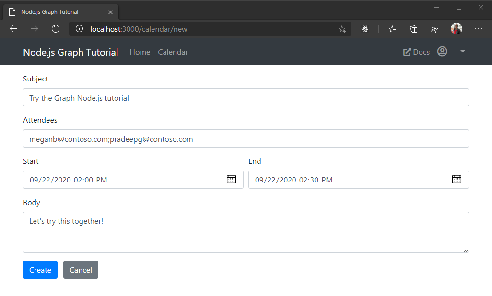

<!-- markdownlint-disable MD002 MD041 -->

在本节中，您将添加在用户日历上创建事件的功能。

## 创建新的事件表单

1. 在名为 **newevent** 的 **/views** 目录中创建一个新文件，并添加以下代码。

    :::code language="html" source="../demo/graph-tutorial/views/newevent.hbs" id="NewEventFormSnippet":::

1. 将下面的代码添加到 **/routes/calendar.js** 文件中的 `module.exports = router;` 第一行。

    :::code language="javascript" source="../demo/graph-tutorial/routes/calendar.js" id="GetEventFormSnippet":::

这将为用户输入实现一个表单，并呈现该表单。

## 创建事件

1. 打开 **。/graph.js** 并将以下函数添加到内部 `module.exports` 。

    :::code language="javascript" source="../demo/graph-tutorial/graph.js" id="CreateEventSnippet":::

    此代码使用窗体字段创建 Graph 事件对象，然后将 POST 请求发送到 `/me/events` 终结点，以在用户的默认日历上创建事件。

1. 将下面的代码添加到 **/routes/calendar.js** 文件中的 `module.exports = router;` 第一行。

    :::code language="javascript" source="../demo/graph-tutorial/routes/calendar.js" id="PostEventFormSnippet":::

    此代码验证并净化了窗体输入，然后调用 `graph.createEvent` 以创建事件。 调用完成后，它将重定向回 "日历" 视图。

1. 保存更改并重新启动该应用。 单击 " **日历** " 导航项，然后单击 " **创建事件** " 按钮。 填写值，然后单击 " **创建** "。 创建新事件后，应用程序将返回到日历视图。

    
