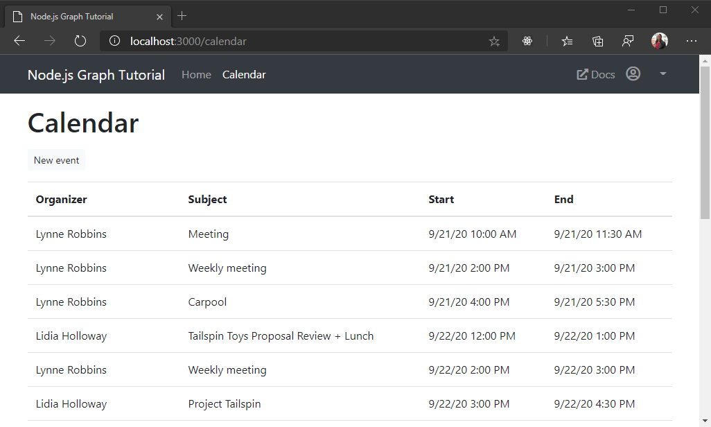

<!-- markdownlint-disable MD002 MD041 -->

<span data-ttu-id="b4467-101">在本练习中, 将把 Microsoft Graph 合并到应用程序中。</span><span class="sxs-lookup"><span data-stu-id="b4467-101">In this exercise you will incorporate the Microsoft Graph into the application.</span></span> <span data-ttu-id="b4467-102">对于此应用程序, 您将使用[microsoft graph 客户端](https://github.com/microsoftgraph/msgraph-sdk-javascript)库调用 microsoft graph。</span><span class="sxs-lookup"><span data-stu-id="b4467-102">For this application, you will use the [microsoft-graph-client](https://github.com/microsoftgraph/msgraph-sdk-javascript) library to make calls to Microsoft Graph.</span></span>

## <a name="get-calendar-events-from-outlook"></a><span data-ttu-id="b4467-103">从 Outlook 获取日历事件</span><span class="sxs-lookup"><span data-stu-id="b4467-103">Get calendar events from Outlook</span></span>

<span data-ttu-id="b4467-104">首先将新方法添加到`./graph.js`文件中, 以从日历中获取事件。</span><span class="sxs-lookup"><span data-stu-id="b4467-104">Start by adding a new method to the `./graph.js` file to get the events from the calendar.</span></span> <span data-ttu-id="b4467-105">在中`module.exports` `./graph.js`的内添加以下函数。</span><span class="sxs-lookup"><span data-stu-id="b4467-105">Add the following function inside the `module.exports` in `./graph.js`.</span></span>

```js
getEvents: async function(accessToken) {
  const client = getAuthenticatedClient(accessToken);

  const events = await client
    .api('/me/events')
    .select('subject,organizer,start,end')
    .orderby('createdDateTime DESC')
    .get();

  return events;
}
```

<span data-ttu-id="b4467-106">考虑此代码执行的操作。</span><span class="sxs-lookup"><span data-stu-id="b4467-106">Consider what this code is doing.</span></span>

- <span data-ttu-id="b4467-107">将调用的 URL 为`/me/events`。</span><span class="sxs-lookup"><span data-stu-id="b4467-107">The URL that will be called is `/me/events`.</span></span>
- <span data-ttu-id="b4467-108">此`select`方法将为每个事件返回的字段限制为只是视图实际使用的字段。</span><span class="sxs-lookup"><span data-stu-id="b4467-108">The `select` method limits the fields returned for each events to just those the view will actually use.</span></span>
- <span data-ttu-id="b4467-109">`orderby`方法按其创建日期和时间对结果进行排序, 最新项目最先开始。</span><span class="sxs-lookup"><span data-stu-id="b4467-109">The `orderby` method sorts the results by the date and time they were created, with the most recent item being first.</span></span>

<span data-ttu-id="b4467-110">在名为`./routes` `calendar.js`的目录中创建一个新文件, 并添加以下代码。</span><span class="sxs-lookup"><span data-stu-id="b4467-110">Create a new file in the `./routes` directory named `calendar.js`, and add the following code.</span></span>

```js
var express = require('express');
var router = express.Router();
var tokens = require('../tokens.js');
var graph = require('../graph.js');

/* GET /calendar */
router.get('/',
  async function(req, res) {
    if (!req.isAuthenticated()) {
      // Redirect unauthenticated requests to home page
      res.redirect('/')
    } else {
      let params = {
        active: { calendar: true }
      };

      // Get the access token
      var accessToken;
      try {
        accessToken = await tokens.getAccessToken(req);
      } catch (err) {
        res.json(err);
      }

      if (accessToken && accessToken.length > 0) {
        try {
          // Get the events
          var events = await graph.getEvents(accessToken);

          res.json(events.value);
        } catch (err) {
          res.json(err);
        }
      }
    }
  }
);

module.exports = router;
```

<span data-ttu-id="b4467-111">更新`./app.js`以使用此新路由。</span><span class="sxs-lookup"><span data-stu-id="b4467-111">Update `./app.js` to use this new route.</span></span> <span data-ttu-id="b4467-112">在`var app = express();`行**前面**添加以下行。</span><span class="sxs-lookup"><span data-stu-id="b4467-112">Add the following line **before** the `var app = express();` line.</span></span>

```js
var calendarRouter = require('./routes/calendar');
```

<span data-ttu-id="b4467-113">然后在`app.use('/auth', authRouter);`行**后面**添加以下行。</span><span class="sxs-lookup"><span data-stu-id="b4467-113">Then add the following line **after** the `app.use('/auth', authRouter);` line.</span></span>

```js
app.use('/calendar', calendarRouter);
```

<span data-ttu-id="b4467-114">现在, 您可以对此进行测试。</span><span class="sxs-lookup"><span data-stu-id="b4467-114">Now you can test this.</span></span> <span data-ttu-id="b4467-115">登录并单击导航栏中的 "**日历**" 链接。</span><span class="sxs-lookup"><span data-stu-id="b4467-115">Sign in and click the **Calendar** link in the nav bar.</span></span> <span data-ttu-id="b4467-116">如果一切正常, 应在用户的日历上看到一个 JSON 转储的事件。</span><span class="sxs-lookup"><span data-stu-id="b4467-116">If everything works, you should see a JSON dump of events on the user's calendar.</span></span>

## <a name="display-the-results"></a><span data-ttu-id="b4467-117">显示结果</span><span class="sxs-lookup"><span data-stu-id="b4467-117">Display the results</span></span>

<span data-ttu-id="b4467-118">现在, 您可以添加一个视图, 以对用户更友好的方式显示结果。</span><span class="sxs-lookup"><span data-stu-id="b4467-118">Now you can add a view to display the results in a more user-friendly manner.</span></span> <span data-ttu-id="b4467-119">首先, 在`./app.js` \*\*\*\* `app.set('view engine', 'hbs');`行后面添加以下代码。</span><span class="sxs-lookup"><span data-stu-id="b4467-119">First, add the following code in `./app.js` **after** the `app.set('view engine', 'hbs');` line.</span></span>

```js
var hbs = require('hbs');
var moment = require('moment');
// Helper to format date/time sent by Graph
hbs.registerHelper('eventDateTime', function(dateTime){
  return moment(dateTime).format('M/D/YY h:mm A');
});
```

<span data-ttu-id="b4467-120">这将实现[Handlebars 帮助](http://handlebarsjs.com/#helpers)程序, 将 Microsoft Graph 返回的 ISO 8601 日期格式化为人友好的内容。</span><span class="sxs-lookup"><span data-stu-id="b4467-120">This implements a [Handlebars helper](http://handlebarsjs.com/#helpers) to format the ISO 8601 date returned by Microsoft Graph into something more human-friendly.</span></span>

<span data-ttu-id="b4467-121">在名为`./views` `calendar.hbs`的目录中创建一个新文件, 并添加以下代码。</span><span class="sxs-lookup"><span data-stu-id="b4467-121">Create a new file in the `./views` directory named `calendar.hbs` and add the following code.</span></span>

```html
<h1>Calendar</h1>
<table class="table">
  <thead>
    <tr>
      <th scope="col">Organizer</th>
      <th scope="col">Subject</th>
      <th scope="col">Start</th>
      <th scope="col">End</th>
    </tr>
  </thead>
  <tbody>
    {{#each events}}
      <tr>
        <td>{{this.organizer.emailAddress.name}}</td>
        <td>{{this.subject}}</td>
        <td>{{eventDateTime this.start.dateTime}}</td>
        <td>{{eventDateTime this.end.dateTime}}</td>
      </tr>
    {{/each}}
  </tbody>
</table>
```

<span data-ttu-id="b4467-122">这将遍历一组事件并为每个事件添加一个表行。</span><span class="sxs-lookup"><span data-stu-id="b4467-122">That will loop through a collection of events and add a table row for each one.</span></span> <span data-ttu-id="b4467-123">现在, 更新中`./routes/calendar.js`的路由, 以使用此视图。</span><span class="sxs-lookup"><span data-stu-id="b4467-123">Now update the route in `./routes/calendar.js` to use this view.</span></span> <span data-ttu-id="b4467-124">将现有路由替换为以下代码。</span><span class="sxs-lookup"><span data-stu-id="b4467-124">Replace the existing route with the following code.</span></span>

```js
router.get('/',
  async function(req, res) {
    if (!req.isAuthenticated()) {
      // Redirect unauthenticated requests to home page
      res.redirect('/')
    } else {
      let params = {
        active: { calendar: true }
      };

      // Get the access token
      var accessToken;
      try {
        accessToken = await tokens.getAccessToken(req);
      } catch (err) {
        req.flash('error_msg', {
          message: 'Could not get access token. Try signing out and signing in again.',
          debug: JSON.stringify(err)
        });
      }

      if (accessToken && accessToken.length > 0) {
        try {
          // Get the events
          var events = await graph.getEvents(accessToken);
          params.events = events.value;
        } catch (err) {
          req.flash('error_msg', {
            message: 'Could not fetch events',
            debug: JSON.stringify(err)
          });
        }
      }

      res.render('calendar', params);
    }
  }
);
```

<span data-ttu-id="b4467-125">保存所做的更改, 重新启动服务器, 然后登录到应用。</span><span class="sxs-lookup"><span data-stu-id="b4467-125">Save your changes, restart the server, and sign in to the app.</span></span> <span data-ttu-id="b4467-126">单击 "**日历**" 链接, 应用现在应呈现一个事件表。</span><span class="sxs-lookup"><span data-stu-id="b4467-126">Click on the **Calendar** link and the app should now render a table of events.</span></span>

