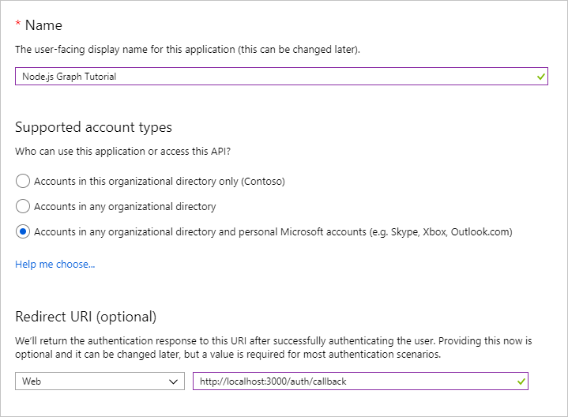
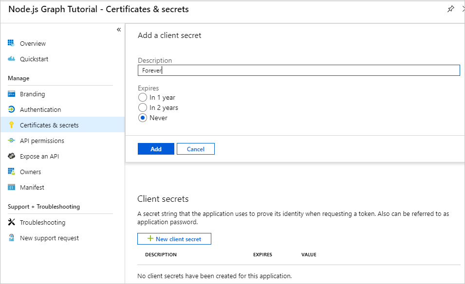

<!-- markdownlint-disable MD002 MD041 -->

在本练习中, 你将使用 azure Active Directory 管理中心创建新的 azure AD web 应用程序注册。In this exercise, you will create a new Azure AD web application registration using the Azure Active Directory admin center.

1. 打开浏览器并导航到[Azure Active Directory 管理中心](https://aad.portal.azure.com)。Open a browser and navigate to the [Azure Active Directory admin center](https://aad.portal.azure.com). 使用**个人帐户**(亦称: Microsoft 帐户) 或**工作或学校帐户**登录。Login using a **personal account** (aka: Microsoft Account) or **Work or School Account**.

1. 在左侧导航栏中选择 " **Azure Active Directory** ", 然后选择 "**管理**" 下的 "**应用注册 (预览)** "。Select **Azure Active Directory** in the left-hand navigation, then select **App registrations (Preview)** under **Manage**.

    

1. 选择 "**新建注册**"。Select **New registration**. 在 "**注册应用程序**" 页上, 按如下所示设置值。On the **Register an application** page, set the values as follows.

    - 将**名称**设置`Node.js Graph Tutorial`为。Set **Name** to `Node.js Graph Tutorial`.
    - 将**支持的帐户类型**设置为**任何组织目录和个人 Microsoft 帐户中的帐户**。Set **Supported account types** to **Accounts in any organizational directory and personal Microsoft accounts**.
    - 在 "**重定向 URI**" 下, 将第一个`Web`下拉下拉箭头, 并`http://localhost:3000/auth/callback`将值设置为。Under **Redirect URI**, set the first drop-down to `Web` and set the value to `http://localhost:3000/auth/callback`.

    

1. 选择 "**注册**"。Choose **Register**. 在**node.js Graph 教程**页上, 复制**应用程序 (客户端) ID**的值并保存它, 下一步将需要它。On the **Node.js Graph Tutorial** page, copy the value of the **Application (client) ID** and save it, you will need it in the next step.

    

1. 选择 "**管理**" 下的 "**身份验证**"。Select **Authentication** under **Manage**. 找到 "**隐式授予**" 部分并启用**ID 令牌**。Locate the **Implicit grant** section and enable **ID tokens**. 选择“保存”\*\*\*\*。Choose **Save**.

    

1. 选择 "**管理**" 下的 "**证书 & 密码**"。Select **Certificates & secrets** under **Manage**. 选择 "**新客户端密码**" 按钮。Select the **New client secret** button. 在 "**说明**" 中输入一个值, 然后选择 "**过期**" 选项之一, 然后选择 "**添加**"。Enter a value in **Description** and select one of the options for **Expires** and choose **Add**.

    

1. 在离开此页面之前复制客户端密码值。Copy the client secret value before you leave this page. 您将在下一步中需要它。You will need it in the next step.

    > [!IMPORTANT]
    > 此客户端密码永远不会再次显示, 因此请务必立即复制。This client secret is never shown again, so make sure you copy it now.

    